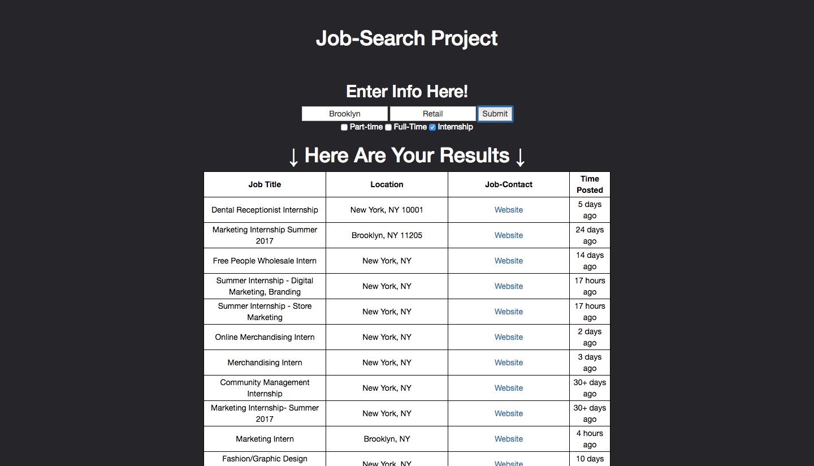

# Job-Search-Indeed

By Joel Colon, Luis Abreu, and Yves. Project Url:

## Problem Statement

Many students have little to no work experience and have trouble finding entry level jobs near them, so we decuded to create a website that allows young people to easily and quickly find nearby job listings for entry level positions.

## Project Description

This project is a vital tool for individuals across the United States who are searching for employment. Though mainly targeted towards teens, it is accessible to people of all ages. All the user has to do is input his or her location, job type preference, and working plan, full or part-time.Then the individual will be given a list of open job positions in their area, along with a link to the website "indeed" where they can apply. This makes access to opportunities more convenient, while adding another source of employment seeking for those who have trouble finding jobs in their area.

## Tech Stack

